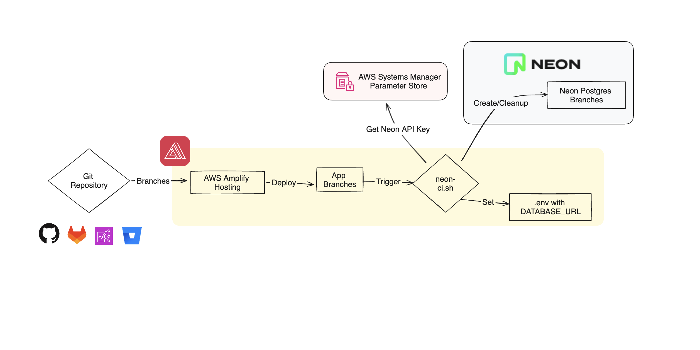

# neon-branches-amplify-cicd

**Neon Postgres Branch for each Amplify Hosting app branch.**

This example outlines how to integrate AWS Amplify Hosting with [Neon Postgres](https://neon.tech/github) for database management through CI/CD pipelines. The setup includes a custom Bash script (`neon-ci.sh`) for creating and cleaning up Neon database branches in correlation with the Amplify app branches. The database connection string for the branch is written into the `.env` file as an environment variable as `DATABASE_URL`.



This example is an `amplify.yml` buildspec for an [Amplify Gen 2 Backend](https://docs.amplify.aws/gen2/build-a-backend/auth/set-up-auth/). Specifically, this Nuxt SSR app is deployed using Amplify Hosting's `WEB COMPUTE` platform.

_This repository is a companion to a [AWS Amplify Gen 2 Full stack CI/CD with Postgres (SSR, Web Compute, Auto-detection, SSM)](https://youtu.be/sBRI4QAZ-oo) YouTube video._

## Amplify Build Settings (`amplify.yml`)

The `amplify.yml` file defines the CI/CD pipeline configuration for AWS Amplify Hosting. It is divided into backend and frontend phases, with specific commands executed at different stages (preBuild, build, and postBuild) for both the backend and frontend environments.

### Backend Configuration

- **Pre-Build Phase**:

  - Installs `jq` for JSON processing.
  - Installs the `neonctl` CLI tool globally using `npm`.

- **Build Phase**:

  - Sets the Node version using `nvm`.
  - Enables `corepack` for package manager version management.
  - Depending on the branch (`main` or `dev`), it either deploys directly using Amplify or generates configuration and calls the `neon-ci.sh` script to manage the Neon database branch.

- **Post-Build Phase**:
  - Cleans up unused Neon database branches if the current branch is not `main` or `dev`.

### Frontend Configuration

- Configures Node, installs dependencies, and builds the project.

### Cache Configuration

- Caches the `pnpm` store path to speed up subsequent builds.

## Neon CI/CD Script (`neon-ci.sh`)

The `neon-ci.sh` script facilitates the creation and cleanup of Neon database branches. It dynamically manages branches based on the AWS Amplify app's branch structure, allowing for isolated database environments per feature branch.

### Script Usage

```bash
./neon-ci.sh <command> [options]

Commands
create-branch:
    Creates a new Neon database branch.

options:
    --app-id <app-id>
    --neon-project-id <project-id>
    --parent-branch-id <parent-branch-id>
    --api-key-param <api-key-param>
    --role-name <role-name>
    --database-name <database-name>
    --suspend-timeout <suspend-timeout>


cleanup-branches:
    Cleans up Neon database branches that no longer
    have corresponding Amplify app branches.

options:
    --app-id <app-id>
    --neon-project-id <project-id>
    --api-key-param <api-key-param>
```

### Features

- Automatically creates and deletes Neon database branches to match the lifecycle of the Amplify app branches.
- Utilizes AWS SSM Parameter Store for securely managing the Neon API key.
- Supports custom database names, roles, and suspend timeouts.

### Requirements

- **Amazon Linux: 2023** Build Image
- AWS CLI: (_Available in the CI/CD build process_) Used during CI/CD for retrieving API keys from SSM Parameter Store and listing Amplify branches .
- Update the Amplify Hosting app backend build role with the correct policy statements

  - For example:

  ```json
  {
    "Version": "2012-10-17",
    "Statement": [
      {
        "Sid": "Statement1",
        "Effect": "Allow",
        "Action": "amplify:ListBranches",
        "Resource": "arn:aws:amplify:*:*:apps/*/branches/*"
      }
    ]
  }
  ```

  For SSM:

  ```json
  {
    "Version": "2012-10-17",
    "Statement": [
      {
        "Sid": "AllowAmplifySSMCalls",
        "Effect": "Allow",
        "Action": [
          "ssm:GetParametersByPath",
          "ssm:GetParameters",
          "ssm:GetParameter"
        ],
        "Resource": ["arn:aws:ssm:*:*:parameter/neon/api-key"]
      }
    ]
  }
  ```

- jq: For processing JSON data.
- [neonctl](https://neon.tech/docs/reference/neon-cli): Neon's command-line tool for managing database branches.

### Integration Steps

1. Set up your Amplify app and CI/CD pipeline as per your project requirements.
2. Choose the Amazon Linux: 2023 build image
3. Enable branch auto-detection for the app to create a new Amplify app branch for each new git branch matching the configured pattern.
4. Set Up your [Neon project and create your an API key](https://neon.tech/github).
5. Modify neon-ci.sh with your specific Neon project ID, database name, and other parameters as needed.

```bash
bash neon-ci.sh create-branch --app-id $AWS_APP_ID --neon-project-id <neon-project-id> --branch-name $AWS_BRANCH --parent-branch main --api-key-param "<ssm-param>" --role-name <neon-role> --database-name <neon-db-name> --suspend-timeout 0
```

6. Create a AWS Systems Manager (SSM) Parameter Store parameter for the Neon API key
7. Add the correct policy permissions to the Amplify app Service role for SSM and Amplify (`amplify:ListBranches`)
8. Deploy: Push your changes and monitor the Amplify consoles for the deployment status. The Neon console will show the created branch(es).
